# Milestone project 1 
# Tanya Allen
## The Women's Coaching Collective

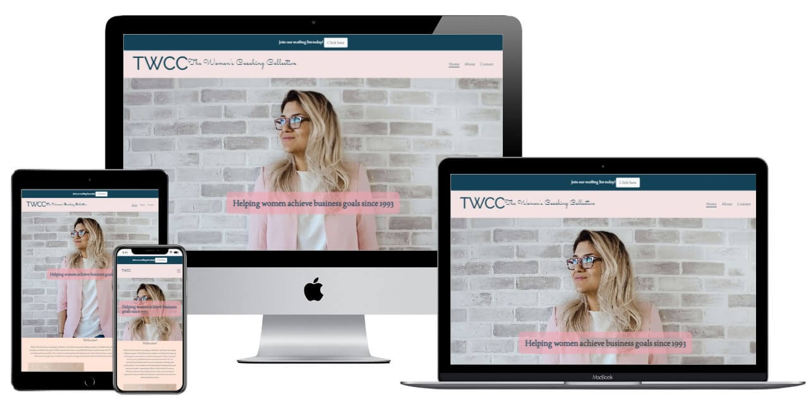

Other page mockups

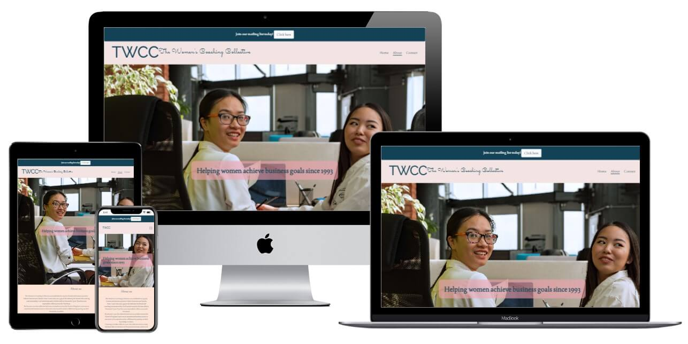

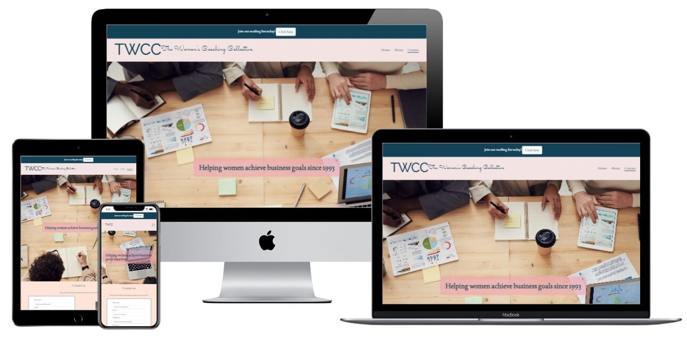

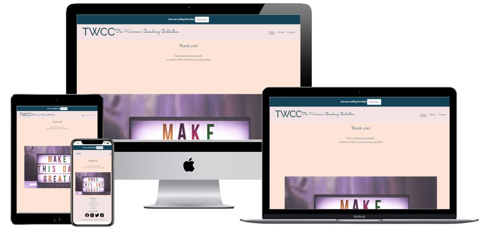

[Click for live site](https://tanyaelizabeth13.github.io/Milestoneproject1/)

### Table of content:
1. [__User experience__](#1-ux)
    * User stories
    * Site structure 
2. [__Design__](#2-design)
    * Wireframes
    * Colours
    * Typography
    * Imagery
    * Design differences
3. [__Site limitations__](#3-site-limitations)
4. [__Features__](#4-features)
    * Existing
    * Future
5. [__Technologies used__](#5-technologies-used)
6. [__Testing__](#6-testing)
7. [__Deployment__](#7-deployment)
8. [__Credits__](#8-credits)

---
### 1 UX
---
#### User Stories

**First time users:**

As a fist time user of the site, I want to be able to get information on the company and what they do.

As a fist time user of the site, I want to learn how to contact the company.

As a fist time user of the site, I want to find where the company is located.

As a fist time user of the site, I want to navigate to the company’s social media.

As a first time user of the site. I want to be able to navigate around the site easily.

As a first time user of the site, I want the site to be attractive and professional looking. 

As a first time user of the site, I want to know my contact message has sent correctly. 

**Returning users:**

As a returning user of the site, I want to be able to quickly find the location of the company, possibly while on the move.

As a returning user of the site, I want to be able to quickly find the contact information of the company. 

As a returning user of the site, I want to feel confident that I have chosen the correct company. 

**Site owners:**

As an owner of the site, I want to bring in new clients by advertising the company and showing what they do.

As an owner of the site, I want to show the history of the company.

As an owner of the site, I want to have contact details easily available for new and current clients. 

As an owner of the site, I want to have the location of the company easily available for new and current clients.

As an owner of the site, I want customers to be able to send a message to contact them back at a later date. 

As an owner of the site, I want the site content to be readable on all devices for all customers. 

#### Site structure

**All pages**

All pages will have a large hero image at the top with a navigation menu in the top right.

The navigation menu will contain links to all other pages and will styled to stand out. 

The navigation menu will change to a hamburger menu on small screen sizes. 

>As a first time user of the site. I want to be able to navigate around the site easily.

All hero images will also have an overlaying tagline to instantly show what the company does.

All pages will also contain a footer at the bottom of the page. This will contain: 

- Quick links to other pages so users don’t have to scroll back up manually.

- The company’s social media links 

> As a fist time user of the site, I want to navigate to the company’s social media.

- The copyright info of the site in small letters right at the bottom. 

Above the footer on all pages there will also be a ‘back to top’ button to save users from manually scrolling back to the top of the page. 

Several testimonials will be shown across the site to show how the company has benefited previous clients. Names for these will be randomly generated.  

> As a returning user of the site, I want to feel confident that I have chosen the correct company.

The bootstrap grid system and media queries will be used throughout the entire site to make sure the layout is responsive on all device sizes.

> As an owner of the site, I want the site content to be readable on all devices for all customers.

**Home page** 

The home page will contain some introductory text about what the company does and what they offer to clients.

> As a fist time user of the site, I want to be able to get information on the company and what they do.

> As an owner of the site, I want to bring in new clients by advertising the company and showing what they do.

There will also be an image with an inspirational message that fits in with the site design. 

**About page** 

The about page will contain a company history story with key points of the company’s past.

> As an owner of the site, I want to show the history of the company.

**Contact page**

The contact page will contain a contact form so users can submit their details and be contacted by the company, the form will require name, phone, email, and postcode.

> As a fist time user of the site, I want to learn how to contact the company.

> As an owner of the site, I want customers to be able to send a message to contact them back at a later date.

There will also be an image with an inspirational message to fit in with the site narrative.

Above the footer the contact page will include an embedded google map showing the location of the company’s head office. With embedded google maps you can click to open it in the google maps app as standard. 

> As a fist time user of the site, I want to find where the company is located.

> As a returning user of the site, I want to be able to quickly find the location of the company, possibly while on the move.

> As an owner of the site, I want to have the location of the company easily available for new and current clients.

---

### 2 Design
---

> As a first time user of the site, I want the site to be attractive and professional looking. 

#### Wireframes

Home page
  

About page

Contact page

#### Colours

The general colour scheme for the site is delicate, feminine, pastel tones.

F3E3E3 and FEE4D7 are used as background colours across all pages. The first for the headers and footer, and the latter for the main body of the site. 

134256 is used for the email alert background to stand out from the rest of the page.

F1A3B0 is used as a background colour on the header text to help contrast it with the images.

134256 is used for all font on the site. 

FFFFFF (white) is used for the contact form, and for the alert text on the dark background. 

#### Typography

All fonts are imported from Google fonts. 

Raleway is used for the main logo.

Sacramento is used for the sub-logo.

Joan is used for all other text throughout the site.

#### Imagery

The site logo was created using basic CSS. This was a design choice to keep it nice and simple, and to not make the pages look too busy with all the other images and colours being used. 

All images from the site are sourced form Pexels.com, a free to use stock photo site. 
The three main site pages all contain a large hero image. 

These have been cropped and reuploaded to look better on smaller devices.

On all four pages of the site there is an image with a motivational message. 

All images fit with the theme of the site and help to promote the brand of the company. They also fit well together creating a standarised theme across the site. 

The site icon in the browser tab is taken from Icons8 and is of a small female logo. Fitting with the site theme.

 

Social media icons are sourced from Icons 8 also, they are part of the same icon pack, so they all fit together.

---

#### Design differences 

There are a few differences to the original designs shown in the wireframes. These where added for either aesthetic reasons or to fulfill user stories. 

There is now a solid header above the hero image, instead of on top like in the wireframes. This choice was made to make the site look cleaner and to make sure the navigation bar is not distracted by the background image. 

A new h3 title has been added to the home page to improve the layout.

The new success page, that the user is navigated to after submitting the contact form, was also not part of the original designs. This was added to confirm to users that they have submitted the form correctly and their information has been received. 

> As a first time user of the site, I want to know my contact message has sent correctly.

Having the elements inside the footer as rows in the original designs was changed to columns instead. This made the footer smaller and made the pages more balanced with the header size. 

Contact information was also added to the footer to make finding it easier.

> As a fist time user of the site, I want to learn how to contact the company.

> As a returning user of the site, I want to be able to quickly find the contact information of the company.

> As an owner of the site, I want to have contact details easily available for new and current clients.

The tagline element has been moved from the original location to a more central one to make the pages more symmetrical and match more with the new header location.

A new image was added to the about page to have it match the feel of the other pages.

An alert bar and modal have also been added as the original idea was to have a popup upon entering the page, but this would not have been in line with marking criteria for this project. 

---

### 3 Site limitations

---
The site does have some limitations that are out of scope for this project.

The forms on the site do not store any data as they would on a real-life project. Submitting information on forms is either sent to the code institute form dump, or links to a successful submission page. 

Social media icons in the page footer do not take the user to real pages as this is a fictional company. 

---

### 4 Features
---

#### Existing

**Email alert**

At the top of all pages there is an alert bar suggesting the user sign up to an email list. It contains a ‘click here’ button that opens the email sign-up modal. 

**Email modal**

An email sign up modal pops up after clicking the ‘click here’ button. This allows the user to submit their details to join the company mailing list. If they change their mind, there is an exit button on the top right of the modal. 

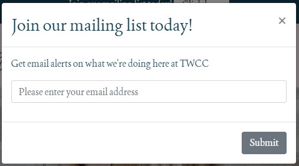

**Header**

Each page has the same header that stays at the top of the page (non-sticky). It contains the sites main logo, sub logo, and the main navigation bar. 

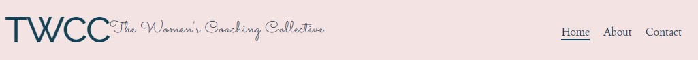

On medium screens the sub logo disappears to make the header look less crowded.

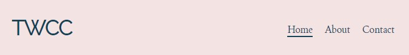

**Hamburger nav menu**

On small screens the navigation bar collapses into a hamburger menu making it look cleaner. 

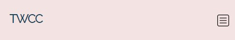

**Contact form**

The contact page contains a simple form. It consists of full name, email address, phone number, and post code. This is enough information for the company to get in touch with the user at a later date. 

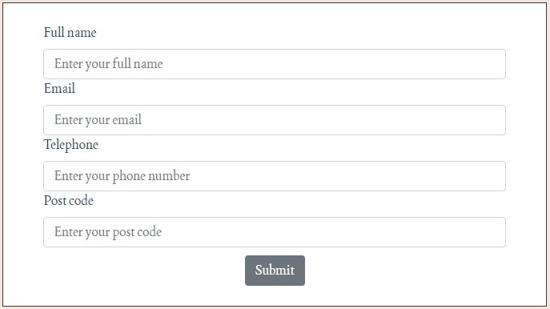

**Success page**

Submitting the form of the contact page take users to a success page saying thank you and letting the user know that the form has been submitted. This is a full page with the same header and footer as the other pages so users can easily navigate through the site.

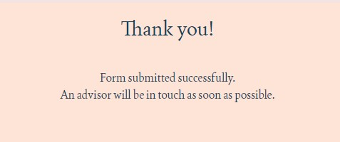

**Embedded map**

The contact page also contains an embedded Google map. As standard with Google embedded maps, the map is interactive and is the user clicks the ‘view larger map’ button it will take them to either the desktop version of the full map, or the Google maps apps. 

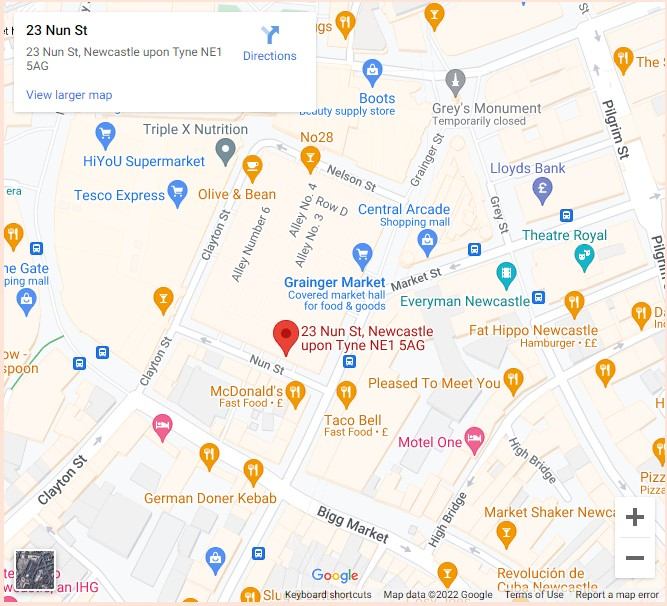

**Back to top button**

All pages contain a ‘Back to top’ button above the footer, so users can quickly return to the top of the site without scrolling. This shows on all screen sizes. 

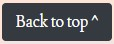

**Footer**

All pages have the same footer that stays at the bottom of the page (non-sticky). It contains a quick links section for users to quickly navigate to other parts of the site, the company contact details, and icons with links to the company’s social media sites. 

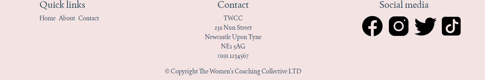

**Social media links**

Within the footer on each page there are four icons linking to the company’s social media accounts. These are: Facebook, Instagram, Twitter, and Tiktok. 

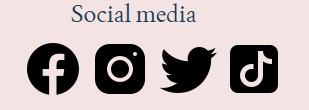

#### Future

As this project is focused on HTML 5 and CSS 3, it leaves a lot of room for possible future features that can be implemented with more advanced technologies. Also, the scope of this project was only to cover three pages, so in a real life project a lot more features would likely be added to a site of this type. 

**Client login**

In future a client login section could be added. This would be an area on the site for current clients to communicate with the company, upload and receive documents, and make appointments with a live booking system. 

**Live social media**

A feed showing the company’s live social media sites could also be added to direct the user to these sites, without them having to click through the links on the page. This could be done using JavaScript or iframe embedded code. 

**Blog section**

A blog section could be added as a way for the company to keep clients updated on the work they are doing. This could be done through a directory of text pages or by using something such as WordPress. 

---

### 5 Technologies used
---

HTML 5 – The coding language used to structure the site and its content. 

CSS 3 – The coding language used to style the site. 

Bootstrap v4.6.1 – The framework used to provide styling and the grid layout. 

Balsamiq – The software used to create wireframes during the design process. 

Google Fonts – Open-source font service used to import all custom fonts on the site. 

Gitpod – The IDE used to write code and commit to Git. 

Git – The software used to manage version control and push to Github. 

Github – The repository site used to store the project pushed from Gitpod, also used to deploy the site via Github Pages. 

TinyJPG – The website used to compress image sizes to reduce storage used, creating faster loading speeds. 

Chrome DevTools – The built-in developer tools used throughout development to check responsivity on all screen sizes. 

WAVE – The accessibility evaluation tool used throughout to check all site aspects are fully accessible to users with disabilities. 

Lighthouse – The developer tool use to test site performance. 

W3 Validator – The validator used to check all pages for syntax errors.

Jigsaw validator – The validator used to check all pages for CSS syntax errors. 

Technsini – The mockup generator site used to create mockup images in README.md. 

Behind the name.com – The site used to generate random names for about page and testimonials.  

Namelix.com  - The site used to generate fake company names used for testimonials.  

Canva – The site used to make image collages for README.md

Microsoft Word - The software used to write README.md, mainly used for spell check purposes. 

---
### 6 Testing
---

The strategy for testing was to cover the areas of responsivity testing, features testing, accessibility testing, performance testing, and validator testing. 

Click for full testing results:

[xlsx file](assets/testing/Testing%20MP1.xlsx)

There are two fails in the features section (test no's F3 and F10). These are both due to data storing from forms being out of scope for this project.

Accessibility testing on all pages still shows an alert (test no's A2, A4, A6, and A8). This is due to a ‘redundant link’ in the nav bar taking you to the same URL. It is ok to keep this alert as to not have a navigation bar with empty links. 

CSS validator testing is still showing 1 warning on all pages because of the hidden form label in the email modal (test no V8). Is warning is ok as the code is a snippet taken from a tutorial and I do not want to make changes to this code snippet as it works well. 

HTML validator is also still showing 1 warning on all pages (test no's V2, V4, and V6). This is due to section classes not using a heading. This is accepted as it is not an error and sections make the code easier to organise. 

---
### 7 Deployment
---

This project was initially created in Github using the Code Institute’s [full template](https://github.com/Code-Institute-Org/gitpod-full-template) 

The project was then deployed using Github Pages by doing the following steps:

-	Open [repository](https://github.com/TanyaElizabeth13/Milestoneproject1)
-	Click Settings
-	Click Pages on the left-hand side
-	In Source select main branch and root
-	Click save
-	Click the link to the live site

---
### 8 Credits
---

**Code**

[This](https://www.w3.org/WAI/tutorials/forms/labels/#note-on-hiding-elements) visually hidden class was used to hide the form label in the email signup modal so it would only be available to screen readers, and it works great. 

    .visuallyhidden {
        border: 0;
        clip: rect(0 0 0 0);
        height: 1px;
        margin: -1px;
        overflow: hidden;
        padding: 0;
        position: absolute;
        width: 1px;
    }

**Media**

All images are open source and taken from Pexels.com 

Full list of images used

[Home hero image](https://www.pexels.com/photo/woman-in-pink-cardigan-and-white-shirt-leaning-on-the-wall-975657/)

[About hero image](https://www.pexels.com/photo/female-colleagues-sitting-beside-each-othre-8101638/)

[Contact hero image](https://www.pexels.com/photo/photo-of-people-having-meeting-3183186/)

[Home inspo image](https://www.pexels.com/photo/a-motivational-message-5238584/)

[About inspo image](https://www.pexels.com/photo/dirty-pattern-texture-abstract-5244123/)

[Contact inspo image](https://www.pexels.com/photo/quote-on-a-wall-5246429/)

[Success inspo image](https://www.pexels.com/photo/illuminated-qoute-board-2255441/)

All icons used are open source and taken from Icons8.com

Full list of icons used

[Browser icon](https://icons8.com/icon/7696/female)

[Facebook icon](https://icons8.com/icon/kQzCK4emnaD2/facebook)

[Instagram icon](https://icons8.com/icon/RhYNENh5cxlS/instagram)

[Twitter icon](https://icons8.com/icon/rQfEoE6vlrLk/twitter)

[Tiktok icon](https://icons8.com/icon/K6KK5ISTAWwE/tiktok)

**Content**

All site copy was written by Tanya Allen. 

All company names and people names were made using random name generators.

The fictitious company name ‘The Women’s Coaching Collective’ was thought up by Briony Sommers.  

**Acknowledgements**

A big thank you to my Code Institute mentor Daisy for her honest feedback and helpful tips.

Thank you to the slack community for answering questions, not just mine but others which made searching for solutions easier.  

Thank you to Irish Becky from the peer review slack channel for her feedback.

[W3Schools](https://www.w3schools.com/) and [Stack overflow](https://stackoverflow.com/) where consulted regularly throughout the project to get a better understanding of good coding practices. 